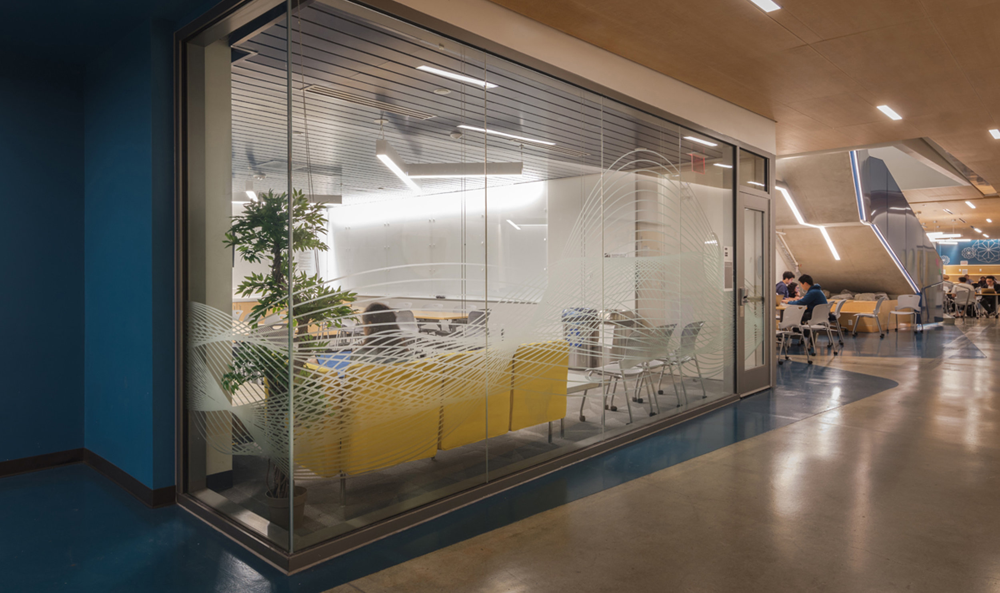

# UCSD CSE 12 Spring 2023

## Meeting with Staff

The main reasons to come see the staff in CSE12 is:

1. You need help on an assignment, 
2. Reviewing past work
3. Understanding something from the course material.

There are two ways to get general help, remotely or in the labs. 

## Student Help Hours (with tutors)
We should make a distinction that when we say "Student Help Hours", we are referring to times 
that you may meet with tutors and TAs to receive help. Office hours to meet with the instructor
are a different option, and are explained later on this page. 

The process for getting help can be found in the
[Tutoring Procedurs](https://docs.google.com/document/d/1pVPE2OyU9atRsfIN221EnR9vE3qTgJrlPJ7J6vdXfY4/edit?usp=sharing){:target="_blank"} document.

Once you've submitted a ticket, a staff member will accept your ticket when available. You will get 
updates in autograder about your ticket once you file it.

### Remote Help

You can get remote help from anywhere as long as you have a stable internet connection, including in the CSE building.

Then follow the steps in the tutoring procedures document for submitting a ticket.

<iframe src="https://calendar.google.com/calendar/embed?src=c_63085ff4ec7102375ab5e8f5412a7859bb1e119f3fe3cb06327616c83c4a4cc0%40group.calendar.google.com&ctz=America%2FLos_Angeles" style="border: 0" width="800" height="600" frameborder="0" scrolling="no"></iframe>

### In-person Help

For in-person help, come to our lab room B240, which is on the lowest level of the CSE building. If there are no seats
in B240, feel free to use another lab on the bottom (basement) floor of the CSE building.

Then follow the steps in the tutoring procedures document for submitting a ticket.

Check on this calendar for our *in-person* availability (also available on the general calendar
page):

<iframe src="https://calendar.google.com/calendar/embed?src=c_49310e531a598365bcad10ea69a0cc9aa47dbf69f9d3601a4e0996c8e69cca1c%40group.calendar.google.com&ctz=America%2FLos_Angeles" style="border: 0" width="800" height="600" frameborder="0" scrolling="no"></iframe>>

#### More information on finding the in-person labs:
<iframe src="https://www.google.com/maps/embed?pb=!1m14!1m8!1m3!1d13402.475705970317!2d-117.2335235!3d32.8818006!3m2!1i1024!2i768!4f13.1!3m3!1m2!1s0x0%3A0xa7dc3be7597d4d47!2sComputer%20Science%20and%20Engineering%20Building!5e0!3m2!1sen!2sus!4v1632176178912!5m2!1sen!2sus" width="600" height="450" style="border:0;" allowfullscreen="" loading="lazy"></iframe>

The labs are on the lowest level of the CSE building; the hallway outside the labs
looks like this:

You don't have to go to the labs just for help – you're also welcome just to go
there to work any time!

### Instructor Office Hours (with professor)

“Office hours” should maybe be called “student hours” – they are times where
we are available in our office (physically or virtually) **for you**. You can
come to instructor office hours with any kind of questions about the course, or
even about the next course, or about catching up if you feel you've fallen
behind, or something you wanted to know more about from lecture, and more. You
can also ask us programming questions in office hours, just like you would in
help hours with the tutors. 

Instructors for this course:
- Greg Miranda
  - Email: `g2miranda@eng.ucsd.edu`
  - **Office hours**: Wednesday 10:00am-11:00am, Friday 10:00am-11:00am, CSE 4204

### Our Staff
The friendly faces of this course! We have 17 staff members (instructors, TAs, and tutors) here 
to support you and help with your learning.

<iframe src="https://docs.google.com/spreadsheets/d/e/2PACX-1vQvPXbeLtlY5oZLcwWtAlWO4Nlvys4l9FHNULdvLh6QkK5gvdiqN4arrVz8ug4MzsbedRsNFg12homZ/pubhtml?widget=true&amp;headers=false" width="100%" height="950px"></iframe>
